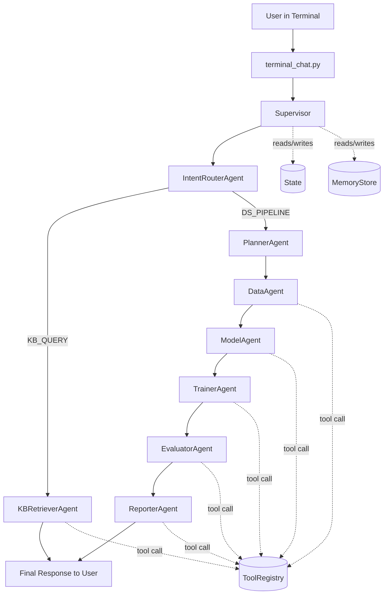
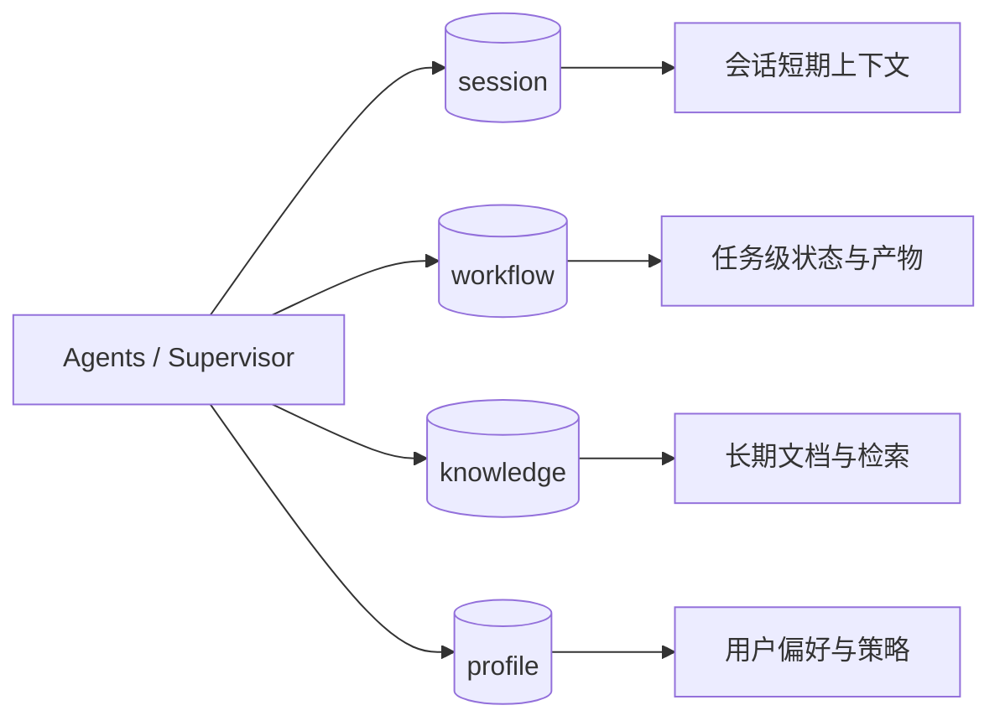
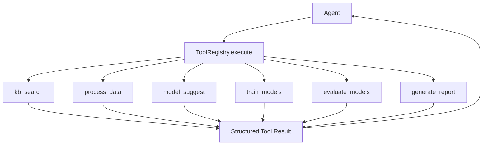
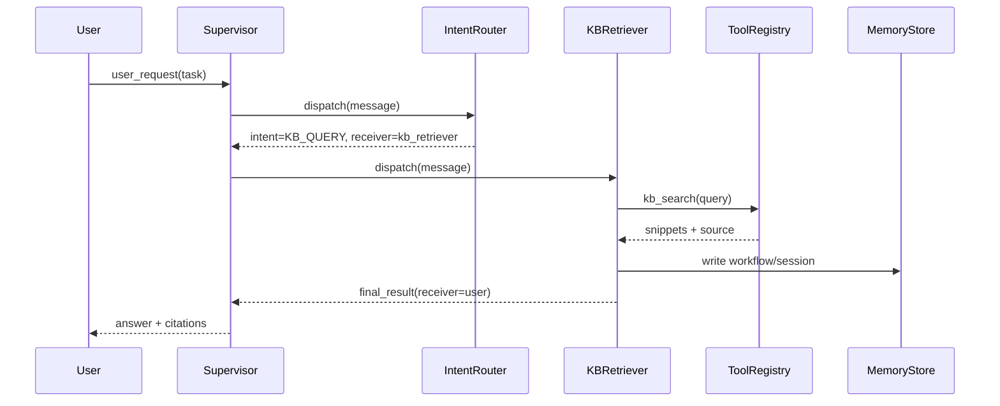
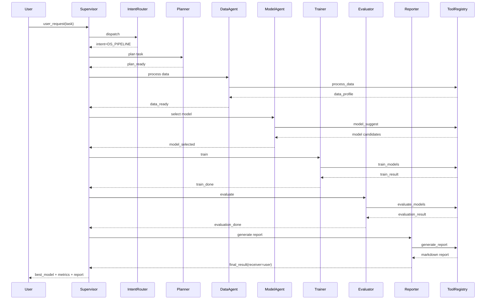

# Multi-Agent System Redesign (for KB + Data/Model Pipeline)

## 1. 对你 3 个问题的直接结论

### 1) 是否有必要下载最新 skills
- 有必要，但不是第一优先级。
- MVP 阶段先把系统主链路跑通（路由、memory、tools、监督执行）。
- 当你要接入新能力（新数据源、新训练后端、新报告模板）时，再增量更新 skills。
- 建议：按月检查一次 skills，按需升级，不要频繁改动影响稳定性。

### 2) Terminal 对话窗口 + agent 交互 + ChatGPT 4o
- 已实现：`terminal_chat.py`
- 默认模型：`gpt-4o`（可通过 `--model` 修改）
- 支持降级：若未配置 `OPENAI_API_KEY` 或 SDK 不可用，自动回退为本地结构化输出。

### 3) 重新梳理系统设计
- 已实现重构骨架：`multi_agent_system.py`
- 支持意图判断两大链路：
  - `KB_QUERY`：查知识库历史信息
  - `DS_PIPELINE`：数据处理 -> 模型选择 -> 训练 -> 评估 -> 报告

## 2. 总体架构

核心组件：
- `Message`：单步通信载荷
- `State`：任务级共享上下文
- `Supervisor`：统一路由与日志
- `Agent`：独立职责，不互相直接调用
- `ToolRegistry`：工具注册、权限、调用入口
- `MemoryStore`：四层 memory 管理

执行主路径：
1. 用户输入进入 `IntentRouterAgent`
2. 路由到 `kb_retriever` 或 `planner`
3. `Supervisor` 持续分发消息直到 `receiver == user`

### 流程图（总览）



## 3. Memory 设计

四层命名空间（已实现）：
- `session`：短期会话消息（近轮上下文）
- `workflow`：单次任务状态、产物、trace
- `knowledge`：长期知识文档（可检索）
- `profile`：用户偏好与策略（预留）

统一 API：
- `put(namespace, key, value)`
- `get(namespace, key)`
- `search(namespace, query, top_k)`

### 流程图（Memory 分层）



## 4. Tool 设计

采用统一注册中心（已实现）：
- `ToolSpec(name, input_schema, output_schema, timeout_s, retry, permission, owner_agent)`
- `ToolRegistry.register(...)`
- `ToolRegistry.execute(name, **kwargs)`
- `ToolRegistry.list_tools()`

当前工具分类：
- Knowledge: `kb_search`
- Data: `process_data`
- Model: `model_suggest`, `train_models`, `evaluate_models`
- Report: `generate_report`

### 流程图（Tool 调用路径）



## 5. 意图路由策略

`IntentRouterAgent` 策略：
- 命中知识库相关关键词 -> `KB_QUERY`
- 否则默认 -> `DS_PIPELINE`

建议升级：
1. 规则优先（低延迟）
2. LLM 兜底（复杂语义）
3. 代码校验输出（只允许白名单意图）

## 6. 两条业务链路

### A. KB_QUERY
- `intent_router -> kb_retriever -> user`
- 输出：知识片段 + source



### B. DS_PIPELINE
- `intent_router -> planner -> data_agent -> model_agent -> trainer -> evaluator -> reporter -> user`
- 输出：最佳模型、关键指标、报告 markdown



## 7. 你现在如何运行

1. 安装依赖：
```bash
pip install -r requirements.txt
```

2. 配置 API Key（可选，推荐）：
```bash
export OPENAI_API_KEY="your_key"
```

3. 启动 terminal：
```bash
python terminal_chat.py --model gpt-4o --workspace .
```

4. 交互命令：
- `/help`
- `/tools`
- `/raw on`
- `/exit`

## 8. 下一步增强建议

1. 把 `knowledge` 从关键字检索升级到向量检索（pgvector / milvus）。
2. 给每个工具补齐输入输出 schema 校验（pydantic）。
3. 把 `train_models` 从 mock 实现替换为真实训练执行器（sklearn / xgboost / ray）。
4. 报告输出增加 HTML/PDF 渲染与 artifact 存储。
5. 引入任务队列（Celery/Arq）承接长时训练任务。
